# CD와 Release Runbook

## Build-once 원칙

한 commit에서 image를 한 번만 build한다. Staging과 production은 동일 digest를
배포하고 환경 설정만 분리한다. Release manifest는 다음 값을 고정한다.

- commit SHA와 workflow run id
- 모든 image digest와 build architecture
- public gateway build flag(`build_flags.market_news_enabled`)
- JSON Schema와 topic manifest SHA-256
- Flyway migration set SHA-256
- SBOM과 vulnerability 결과

Mutable tag를 deployment identity로 사용하지 않는다.
News UI flag와 staging `enable_market_news_public` 값은 일치해야 하며, 불일치한
manifest는 deploy workflow가 apply 전에 차단한다.

## Pipeline 분리

| Pipeline | 권한 | 동작 |
|---|---|---|
| `foundation-plan` | read-only | network/DB/MSK/KMS plan |
| `foundation-apply` | protected apply | 승인된 foundation plan |
| `contract-promote` | Glue contract role | compatible schema version 등록 |
| `deploy-staging` | staging deploy | `main` GREEN manifest 자동 배포 |
| `deploy-production` | production deploy | 7일 안정화 manifest만 승인 배포 |
| `restore-drill` | backup/restore | release와 독립된 검증 |

동일 environment 배포는 concurrency lock으로 직렬화한다. Foundation apply와
workload deploy role은 분리한다.

## CD state

### 그림: build-once promotion

```mermaid
flowchart LR
    PR[Pull Request] --> CI[CI · contract · security]
    CI -->|GREEN + merge| Main[main]
    Main --> Build[Build once]
    Build --> Manifest[Digest · SBOM · hashes]
    Manifest --> StageSchema[Staging schema]
    StageSchema --> StageConsumer[Staging consumers]
    StageConsumer --> StageProducer[Staging producers/APIs]
    StageProducer --> StageTest[Smoke · Kafka E2E · k6]
    StageTest -->|7일 안정화| Approval[Production approval]
    Approval --> ProdSchema[Production schema]
    ProdSchema --> ProdConsumer[Production consumers]
    ProdConsumer --> ProdProducer[Production producers/APIs]
    ProdProducer --> Verify[Smoke · alarm · digest evidence]
    Verify --> Release[GitHub Release]
```



범례: Contract, consumer, producer 순서가 compatibility boundary다. 어느
단계든 실패하면 다음 environment로 승격하지 않는다. Staging producer
실패는 이전 digest로 rollback하고 outbox를 보존한다.

## 최초 배포

1. Foundation plan의 비용, IAM, `0 to destroy`를 승인한다.
2. Secret container만 만들고 값은 bootstrap task가 채운다.
3. Fresh DB에 migration task를 실행한다.
4. Runtime grants와 cross-secret deny를 확인한다.
5. Schema를 등록하고 consumer를 internal-only로 배포한다.
6. Producer/API를 배포해 internal smoke와 Kafka E2E를 통과한다.
7. Gateway listener에 연결한 뒤 public smoke를 수행한다.

첫 배포에는 이전 `COMPLETED` revision이 없으므로 listener 연결 전 smoke가
필수다.

## Rolling update와 검증

- ECS `minimumHealthyPercent=100`, `maximumPercent=200`
- deployment circuit breaker/automatic rollback 활성
- migration-before-service, consumer-before-producer
- service stable 뒤 public/user/admin/internal-block route matrix 확인
- `traceId`, `eventId`, `correlationId`, release digest 연결 확인
- 질문, email, raw payload, query-string credential이 log에 없는지 확인

## Rollback

1. Producer를 이전 task definition/image digest로 먼저 복귀한다.
2. Consumer를 이전 digest로 복귀한다.
3. Gateway route와 alarm을 검증한다.
4. DB down migration, schema/topic/version 삭제는 하지 않는다.
5. Migration 문제는 forward-fix한다.
6. Outbox/DLQ를 보존하고 replay 여부는 별도 승인한다.

Operator 명령은 captured task definition ARN과 reviewed environment를 명시해야
한다. Plan/state, credential, private key를 argv나 evidence에 기록하지 않는다.

### ECS 상태 확인과 rollback 명령

다음 변수는 incident ticket과 release manifest에서 검토한 ARN만 사용한다.
`SERVICE_ARN`과 `PREVIOUS_TASK_DEFINITION_ARN`이 대상 environment와 다르거나,
이전 revision이 `COMPLETED`가 아니면 실행하지 않는다.

```bash
aws ecs describe-services \
  --cluster "$CLUSTER_ARN" \
  --services "$SERVICE_ARN" \
  --query 'services[0].{status:status,desired:desiredCount,running:runningCount,deployments:deployments}'

aws ecs update-service \
  --cluster "$CLUSTER_ARN" \
  --service "$SERVICE_ARN" \
  --task-definition "$PREVIOUS_TASK_DEFINITION_ARN" \
  --force-new-deployment

aws ecs wait services-stable \
  --cluster "$CLUSTER_ARN" \
  --services "$SERVICE_ARN"
```

Producer service를 먼저 rollback한 뒤 consumer에 같은 절차를 적용한다. `wait`
실패, desired/running 불일치, circuit breaker failure, ALB 5xx 1% 초과,
outbox/lag 5분 초과 또는 DLQ 신규 event가 있으면 traffic 확대를 중단한다.

## 중단 조건

- release manifest hash/digest/SBOM가 원본 commit과 다르다.
- staging deploy 또는 7일 dashboard가 완료되지 않았다.
- schema compatibility, Kafka E2E, map p95, restore drill이 실패했다.
- plan이 foundation allowlist 밖 resource를 변경한다.
- 이전 digest/rollback evidence 또는 첫 배포 internal smoke가 없다.
- production 비용 승인과 protected environment 승인이 없다.
