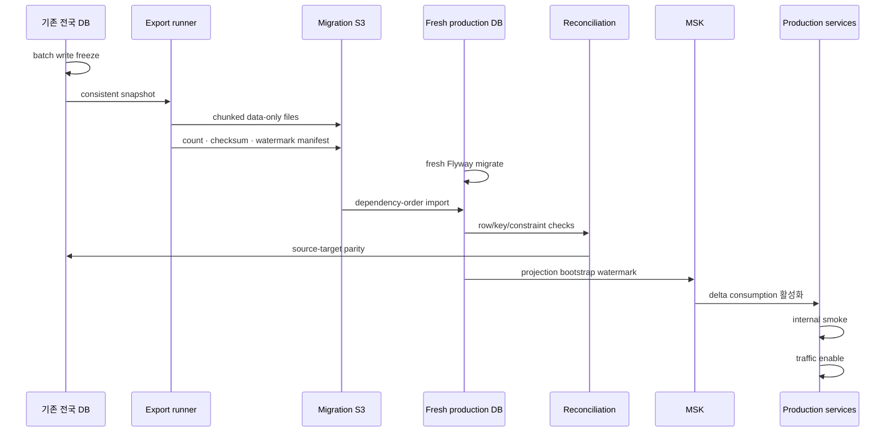

# Data Migration과 DR Runbook

## 안전 원칙

- Target schema는 fresh Flyway만 생성한다.
- Source schema owner와 Flyway history는 복사하지 않는다.
- Source는 cutover 검증 전까지 변경·삭제하지 않는다.
- Table/column allowlist 밖 row와 secret은 export하지 않는다.
- Historical row를 Kafka로 재발행하지 않는다.
- 기존 DB/volume 삭제와 down migration은 이 runbook에 없다.

## Data-only allowlist와 순서

실제 column 목록은 export 시점의 migration catalog와 대조해 manifest로
고정한다. 의존 순서는 다음과 같다.

1. region과 parcel
2. complex와 display-coordinate/metadata evidence
3. raw trade ingest와 match evidence
4. normalized trade와 source-key registry
5. collection execution/work unit
6. published insight/news snapshot과 lineage
7. user-owned identity/subscription/inbox 데이터
8. AI filtered bootstrap artifact
9. coordinate source snapshot은 기존 source-data import/cutover 도구 사용

각 large table은 deterministic ID/date chunk로 나누고 chunk마다 SHA-256,
row count, min/max key, source snapshot watermark를 기록한다. Parent→child
순서 import 후 sequence를 재설정한다.

## Migration 흐름

### 그림: fresh-schema data-only migration

범례: Source, encrypted migration S3, production DB는 서로 다른 trust
boundary다. Checksum/constraint/API parity가 실패하면 traffic과 Kafka delta를
활성화하지 않고 target을 격리한다. Source write를 재개하거나 새로운
consistent snapshot으로 forward retry한다.

## Reconciliation

- raw row와 normalized trade 관계
- duplicate normalized trade `0`
- `complex_id`, `complex_pk`, `apt_seq`, `source`, `source_key` 보존
- failed-match state/reason queryability
- parcel/complex/trade FK와 registry composite reference
- PostGIS SRID와 valid geometry
- insight/news snapshot lineage
- AI projection count/checksum/query parity
- API fixture와 marker result hash
- source/target row count와 chunk checksum

어느 항목이든 mismatch면 cutover를 중단한다. Threshold를 낮춰 통과시키지
않는다.

## Cutover

1. 배치/schedule write를 freeze하고 watermark를 기록한다.
2. 최종 delta export/import/reconciliation을 수행한다.
3. Consumer를 watermark 이후 offset에 배치한다.
4. Internal smoke와 read-only API parity를 확인한다.
5. 제한된 traffic을 연결하고 5xx/latency/lag/outbox/DLQ를 관측한다.
6. 24시간, 72시간 gate 뒤 source retirement 결정을 별도로 승인한다.

Rollback은 traffic을 이전 digest/source 경로로 돌리고 schedule을 pause한다.
Target DB에 down migration을 실행하거나 source를 삭제하지 않는다.

## Primary-region restore

목표는 `ap-northeast-2` 내 RPO 5분/RTO 30분이다.

1. 장애 범위와 마지막 정상 PITR 시점을 확정한다.
2. 새 private subnet/SG의 RDS로 restore한다.
3. Migration version, grants, checksum, row/key/API parity를 검증한다.
4. ECS secret endpoint를 새 DB로 새 version에 갱신한다.
5. Consumer/outbox watermark와 duplicate-safe replay를 검증한다.
6. 제한 traffic 후 정상화한다.

기존 손상 DB를 in-place overwrite하지 않는다.

## Cross-region restore

목표는 region 장애 RPO 24시간/RTO 8시간이다. 기본 restore region은
`ap-northeast-1`이다.

1. Operator가 region disaster를 선언하고 DNS 전환 승인을 받는다.
2. Daily encrypted backup copy와 ECR digest availability를 확인한다.
3. Tokyo production root를 reviewed variables로 apply한다.
4. Fresh migration 후 data-only restore/reconciliation을 수행한다.
5. Schema, consumer, producer 순서로 동일 digest를 배포한다.
6. Internal/public smoke 후 DNS를 수동 전환한다.

자동 DNS failover는 사용하지 않는다. Image가 복제되지 않았다면 manifest의
동일 digest를 검증 가능한 방식으로 복사하고 digest가 달라지면 중단한다.

## Drill과 evidence

- 매월 automated restore verification
- 분기 1회 Tokyo restore game day
- restore start/end, backup watermark, achieved RPO/RTO
- manifest/checksum/API parity
- operator, approval, DNS change, rollback 결과

Backup age 26시간 초과, checksum mismatch, 목표 RPO/RTO 실패는 production
승격 차단 evidence다.
