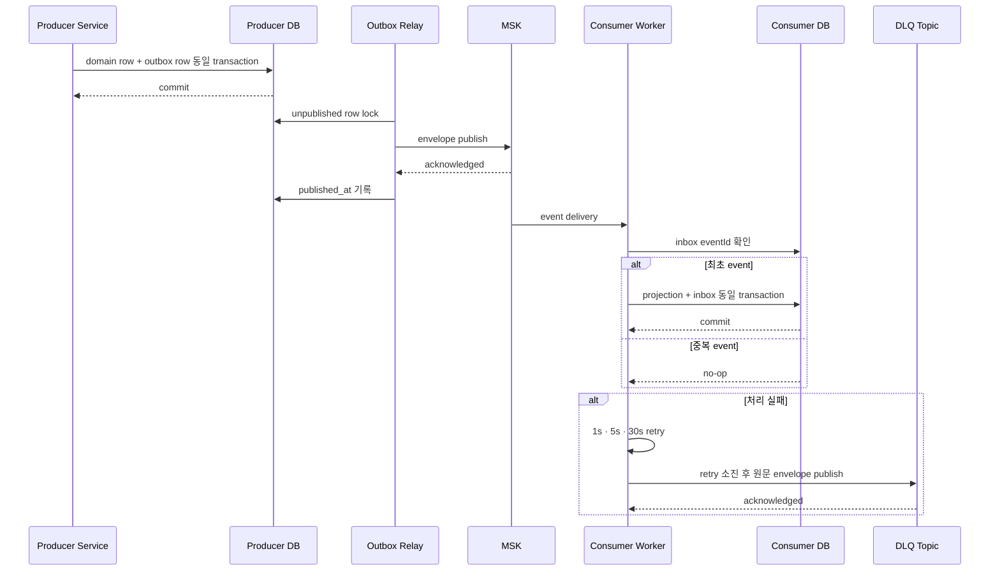

# Kafka 이벤트 아키텍처

## 범위와 원칙

Kafka는 서비스 간 비동기 상태 전달에만 사용한다. Browser/public API,
admin command, chatbot JSON/SSE, ML inference는 기존 HTTP 경로를 유지한다.
전달 보장은 at-least-once이며 exactly-once라고 표현하지 않는다.

## Topic·event·ownership

| Topic | 대표 event | Producer | Consumer | 초기 partitions | retention |
|---|---|---|---|---:|---:|
| `property.trade-events.v1` | `TradeNormalized`, `TradeCanceled` | property | AI projection | 6 | 14일 |
| `property.complex-events.v1` | `ComplexChanged` | property | AI projection | 6 | 14일 |
| `property.insight-events.v1` | `InsightPublished`, `NewsSnapshotPublished` | property | user digest | 3 | 14일 |
| `user.delivery-events.v1` | `InboxCreated`, `EmailRequested`, `EmailSuppressed` | user | delivery/audit | 3 | 14일 |
| `ai.dataset-events.v1` | `DatasetActivated`, `DatasetQuarantined` | AI | AI worker/audit | 3 | 14일 |
| `<main-topic>.dlq` | 실패한 원문 envelope | consumer | operator replay | 1 | 30일 |

최대 message 크기는 256KiB다. Compacted topic, partition 감소, topic 자동
삭제는 초기 범위에서 금지한다. Partition 증가는 staging ingress/egress/lag
측정과 `aggregateVersion` 순서 검증 뒤 승인한다.

## 공통 envelope

```json
{
  "eventId": "6f6f7f2f-5c1e-4aab-9426-0c6a3fa38aad",
  "eventType": "TradeNormalized",
  "schemaVersion": 1,
  "occurredAt": "2026-07-24T03:00:00Z",
  "producer": "property-data",
  "aggregateType": "Trade",
  "aggregateId": "opaque-id",
  "aggregateVersion": 17,
  "correlationId": "opaque-id",
  "causationId": null,
  "traceId": "opaque-id",
  "payload": {}
}
```

필수 필드는 additive하게만 확장한다. `eventId`는 UUID, `occurredAt`은 UTC
ISO-8601, `schemaVersion`과 `aggregateVersion`은 양의 정수다.

금지 데이터:

- RTMS/NAVER raw payload와 `source_key`
- OAuth identity/provider token과 사용자 email
- prompt/answer 전문
- provider key가 포함된 URL
- secret, DB credential, RSA key

`userId`는 opaque internal identifier로만 허용한다. Email worker가 user DB에서
email을 조회하며 event에는 넣지 않는다.

## Outbox·inbox·retry·DLQ

### 그림: transactional outbox와 idempotent consumer



범례: Producer DB와 Consumer DB는 서로 다른 trust boundary다. Relay가 MSK
ack를 받지 못하면 `published_at`을 기록하지 않는다. DLQ publish가 실패하면
원본 offset을 commit하지 않는다. 발행 완료 outbox는 30일 뒤 maintenance가
정리하며 consumer dedupe evidence는 Kafka+DLQ replay보다 긴 45일을 유지한다.

`aggregateVersion <= current projection version`이면 stale/duplicate no-op다.
더 큰 version gap은 projection을 적용하지 않고 retry 후 DLQ로 격리한다.

## Replay와 bootstrap

- Replay tool은 source topic, partition, offset, event id, operator와 이유를
  evidence로 남긴다.
- Replay도 같은 inbox idempotency와 version rule을 통과해야 한다.
- Historical property rows를 Kafka로 전부 재발행하지 않는다.
- AI projection은 filtered bootstrap artifact와 checksum으로 초기화하고,
  manifest의 watermark 이후 delta만 consume한다.
- DLQ item 삭제는 금지한다. 성공한 replay와 원문 DLQ offset을 연결한다.

## Glue Schema Registry promotion

Terraform은 registry, KMS, IAM, log/metric만 소유한다. JSON Schema 원본은
repository가 소유하고 contract workflow가 Glue version을 등록한다. Runtime은
release에 포함된 schema로 plain JSON을 local validation하며 producer
auto-registration은 비활성화한다. Schema는 Glue가 지원하는 JSON Schema
Draft-07을 사용하며 contract validator가 다른 draft를 거부한다.

Promotion 순서:

```text
local schema validation
  → staging Glue compatibility/register
  → staging consumer
  → staging producer
  → staging E2E
  → production Glue register
  → production consumer
  → production producer
```

Compatibility mode는 `BACKWARD_ALL`이다. Release manifest에 schema와 topic
manifest SHA-256을 포함한다. Compatibility 실패 시 기존 version을 삭제하거나
수정하지 않고 producer 배포를 중단한다.

## Fixture와 검증

| Event | Producer fixture | Consumer fixture | 필수 RED |
|---|---|---|---|
| `TradeNormalized` | raw-first commit 후만 생성 | duplicate/stale no-op | raw rollback 시 outbox 없음 |
| `TradeCanceled` | canonical identity와 version | active projection cancel | 역순 version no-op |
| `ComplexChanged` | public-safe field만 포함 | opaque id projection | `source_key` 거부 |
| `InsightPublished` | published snapshot만 | inbox idempotency | rejected snapshot 거부 |
| `NewsSnapshotPublished` | snapshot id/cutoff만 | user inbox snapshot reference | title/email 포함 거부 |
| delivery events | consent/suppression state | audit idempotency | email/token 포함 거부 |
| dataset events | activated/quarantined state | version monotonicity | prompt/answer 포함 거부 |

Integration evidence는 publish failure, duplicate, stale version, retry,
DLQ, DLQ publish failure, replay, consumer restart를 포함한다.

현재 repository에서 `user-insight-worker`는 plain JSON v1을 closed-field로
검증하고 `user-digest-v1` group으로 `property.insight-events.v1`만 읽는다.
1초·5초·30초 재시도 소진 뒤 원문을
`property.insight-events.v1.dlq`로 발행하며, DLQ publish 실패는 recover
성공으로 처리하지 않는다. User DB의 inbox/projection/consumer evidence는 한
transaction으로 적용되고, 90일 inbox와 45일 consumer evidence는 매일
retention 작업으로 정리된다. 이 scheduler는
`home.insight.retention.enabled=true`인 명시적 단일 workload에서만 등록한다.
실제 MSK publish/restart/replay 증거가 생기기
전까지 상태는 `live-capable`이다.

## Local event 전달 검증

`infra/docker-compose.local.yml`의 `events` profile은 production MSK를
대체하지 않는 단일-node Redpanda 검증 환경이다. 기본 compose 실행에는
포함되지 않으며 host listener도 `127.0.0.1`에만 노출한다. 기동 시 Flyway를
먼저 실행하고 main topic 5개와 DLQ 5개를 idempotent하게 생성한 뒤,
property outbox relay를 한 번 실행하고 user insight worker를 유지한다.

```bash
docker compose --profile events -f infra/docker-compose.local.yml \
  up --build redpanda event-topics property-flyway user-flyway \
  property-event-relay user-insight-worker
```

main topic은 14일·DLQ는 30일 retention, message limit은 256KiB로 고정한다.
종료할 때는 `docker compose ... stop` 또는 `down`만 사용하고 Redpanda/Postgres
volume을 보존한다. 이 환경의 단일 replica 성공은 MSK IAM, restart/replay,
consumer lag에 대한 실제 staging 증거를 대체하지 않는다.
