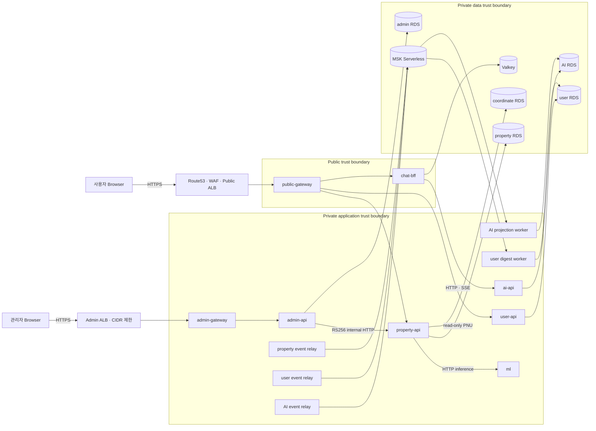

# 운영 플랫폼 계획

## 목적과 상태 기준

이 문서는 Home Search의 staging/production 운영 고도화 순서와 gate를
정의한다. 기존 public API URL과 response shape, raw-first ingest,
duplicate-safe normalized trade, failed-match queryability, `complex_id`
operational relation은 바꾸지 않는다.

| 상태 | 의미 | 현재 대상 |
|---|---|---|
| `live` | local/runtime에서 현재 동작하고 계약 검증이 있는 경로 | map/search/detail/trade, latest/weekly insight, property/admin/user API |
| `live-capable` | 배포 코드는 있으나 실제 AWS 운영 증거가 없는 경로 | staging Terraform, immutable ECR, OIDC, release/deploy workflow, subscription/inbox와 user insight worker |
| `maintenance` | operator 또는 schedule이 명시적으로 실행하는 경로 | backup/restore, runtime grants, coordinate import, 성능 evidence |
| `one-shot` | 성공 후 종료해야 하는 경로 | Flyway, secret/DB bootstrap, property batch, admin ops |
| `later-scope` | 별도 rollout gate 전에는 production critical path가 아닌 경로 | email digest/SES, AI projection |

코드 검증은 실제 운영 검증을 대신하지 않는다. staging plan/apply, MSK/Glue
E2E, 7일 안정화, 비용 승인, production cutover는 각 단계의 별도 증거다.

## 서비스·DB·workload inventory

| 소유자 | Service/worker | 소유 데이터 | 동기 경로 | 비동기 경로 |
|---|---|---|---|---|
| property | property API/batch/event relay | property DB, coordinate DB read-only | public/admin/ML HTTP | trade/complex/insight producer |
| admin | admin API/ops | admin DB | internal RS256 HTTP | 없음 |
| user | user API/digest/event relay | user DB | authenticated HTTP | digest consumer, delivery producer |
| AI | AI API/projection/importer | AI DB, temporary `ai_read` bridge | chat-bff HTTP/SSE | property consumer, dataset producer |
| edge | public/admin gateway | 없음 | exact-path routing | 없음 |
| source-data | coordinate importer | coordinate DB | one-shot import | 없음 |

Production은 property/admin/user/AI/coordinate DB를 물리적으로 분리한다.
Staging은 primary RDS의 database 분리를 허용하되 credential, role, security
group과 service ownership을 유지한다. RDS master secret은 bootstrap task 외의
workload에 전달하지 않는다.

## 목표 SLO·RPO·RTO

| 범위 | 목표 |
|---|---|
| 월간 availability | `99.9%` |
| primary region 내 AZ/service/DB 장애 | RPO 5분, RTO 30분 |
| 전체 region 장애 | RPO 24시간, RTO 8시간 |
| map seed-wide | p95 2초 이하, 오류율 1% 미만 |

`99.9%`는 최소 한 달의 production 관측 전에는 달성 증거가 아니다. Region
장애 목표는 `ap-northeast-1` encrypted backup restore를 전제로 하며 자동
active-active failover를 의미하지 않는다.

## 전체 서비스 구조

### 그림: Home Search service/data/event topology



범례: 실선 HTTP는 즉시 응답이 필요한 호출, MSK 화살표는 at-least-once
비동기 전달, 원통은 service-owned 저장소다. Browser/public API는 Kafka를
사용하지 않는다. Kafka 장애 시 producer transaction은 outbox를 보존하고,
consumer 장애 시 원본 offset을 commit하지 않으며 retry/DLQ 정책을 따른다.

## 선택과 결정

| 선택 | 결정 | 운영 조건 |
|---|---|---|
| 단일 AWS 계정 | 초기 제약으로 유지 | state/KMS/IAM/VPC 환경 격리와 cross-env deny test |
| Production 5개 RDS | 유지 | workload별 sizing, restore, 비용 승인 |
| MSK Serverless | 유지 | 두 환경 cluster-hour/partition-hour 비용 승인 |
| Kafka-first | 비동기 상태 변경에만 적용 | 동기 request/response 금지 |
| JSON Schema + Glue | governance registry | runtime은 저장소 schema로 plain JSON validation |
| 자동 staging CD | `main` GREEN 후 동일 digest | 7일 실증 전 production 금지 |
| 단일 region + cross-region backup | 유지 | quarterly Tokyo restore game day |

## 단계와 gate

| 단계 | 산출물 | 통과 조건 | 책임 |
|---:|---|---|---|
| 0 | 운영/Kafka/Terraform/CD/migration 문서와 ADR | 링크, Mermaid, ownership review | platform |
| 1 | map 성능 P0 | 8,595-row parity hash, cold/warm 3회, p95 ≤2s | property |
| 2 | staging/prod profile, exact gateway route | fail-fast profile와 route matrix | service/edge |
| 3 | workload IAM/secret | cross-secret/cross-env deny test | security/platform |
| 4 | JSON Schema/contract CI | local validation, incompatible RED | platform/service |
| 5–10 | outbox/inbox, event, AI/user/digest/web | duplicate/retry/DLQ/auth/adapter tests | service owners |
| 11–13 | modules, staging workload, automatic CD | actual plan/apply, E2E, restore, 7일 dashboard | platform |
| 14 | production foundation | 비용 승인, `0 to destroy`, isolation | platform/security |
| 15 | data-only migration | manifest/checksum/API-marker parity | data/platform |
| 16 | cutover | 24h/72h alarms and rollback readiness | operator |

## Production 선행 중단 조건

- public API URL, field, unit, error shape 변경이 필요하다.
- `complex_id`, `complex_pk`, stored enum 의미를 재해석해야 한다.
- raw-first/dedupe/failed-match queryability가 훼손된다.
- map p95, schema compatibility, checksum, restore, 7일 안정화 gate가 실패한다.
- plan에 예상하지 않은 DB/MSK/KMS/S3 destroy가 있다.
- event에 PII/raw/secret이 포함된다.
- staging/production role이 상대 환경 state나 secret에 접근한다.
- 월비용, SES feedback/suppression, AI projection parity가 승인되지 않았다.

## 2026-07-25 P0 재측정

Local 전국 DB는 `parcel=43,738`, `complex=44,217`, `trade=7,611,718`이었다.
Redis marker cache를 끈 API에 `seed-wide` 고정 요청을 1 VU로 6회 실행한
결과는 `checks=100%`, `http_req_failed=0%`, p95 `8,937.67ms`였다. 이는
production 선행 기준 2초를 충족하지 않는다.

```bash
k6 run \
  -e SCENARIO=smoke \
  -e BASE_URL=http://localhost:8080 \
  -e SMOKE_ITERATIONS=6 \
  -e COMPLEX_WEIGHT=1 \
  -e REGION_WEIGHT=0 \
  -e COMPLEX_CASE=seed-wide \
  -e REQUEST_TIMEOUT=60s \
  apps/property-data/perf/k6/map-marker-baseline.js
```

이 측정은 local gate evidence이며 staging/production 성능을 대표하지 않는다.
결과 parity hash와 cold/warm 각 3회 read-model 비교가 없으므로 임계값을
낮추거나 production 단계를 진행하지 않는다.

## 잔여 위험

- 단일 계정은 다중 계정보다 환경 격리가 약하며 AWS Organizations 이전
  경로를 유지해야 한다.
- MSK Serverless와 5개 RDS는 초기 트래픽 대비 고정비가 높을 수 있다.
- 단일 region은 자동 region failover를 제공하지 않는다.
- `ai_read` 제거는 dual-read parity와 ADR gate 전에는 허용되지 않는다.
