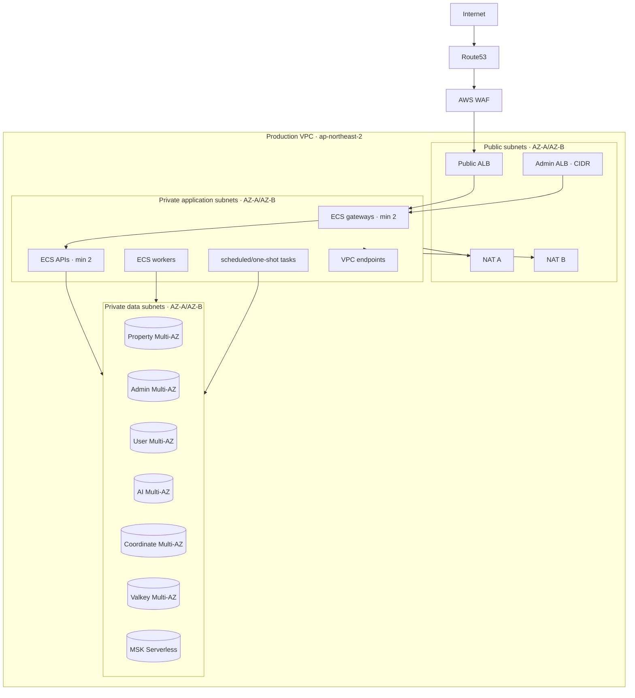
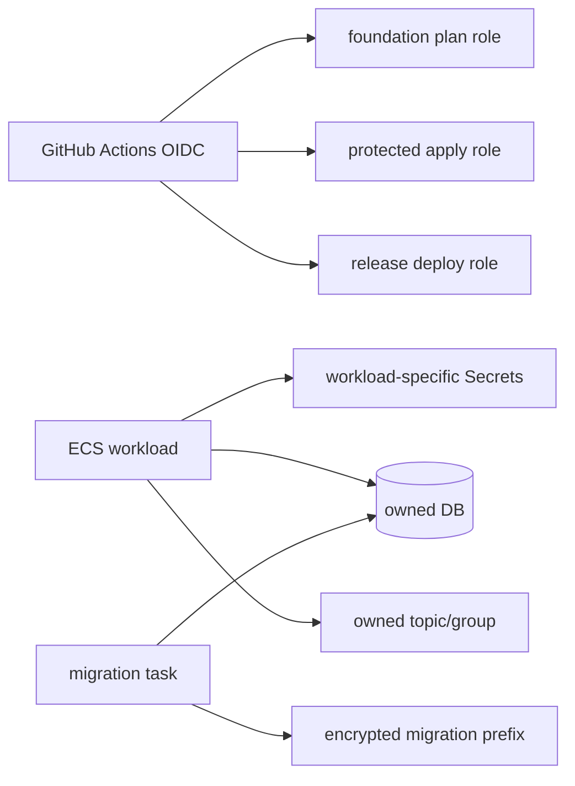

# Terraform 환경 설계

## Root와 state

```text
infra/terraform/
├── bootstrap/
├── modules/
│   ├── network/
│   ├── edge/
│   ├── ecs-platform/
│   ├── ecs-service/
│   ├── scheduled-task/
│   ├── postgres/
│   ├── valkey/
│   ├── streaming/
│   ├── observability/
│   └── backup/
├── staging/
└── production/
```

Terraform workspace는 사용하지 않는다. State key는
`home-search/staging/terraform.tfstate`와
`home-search/production/terraform.tfstate`로 고정한다. S3 versioning, KMS,
`use_lockfile=true`를 사용하며 각 OIDC role은 자신의 state object와
`.tflock`만 접근한다. Plan 파일과 state는 secret으로 취급한다.

기존 staging address를 module로 옮기기 전 remote state 존재 여부와 address
mapping을 확인하고 `moved` block을 사용한다. 한 module씩 `0 to destroy`를
확인한다. State가 불명확하면 이동을 중단한다.

## Module 책임

| Module | 입력 | 출력 | 금지 |
|---|---|---|---|
| network | CIDR, AZ, NAT 수 | subnet/route/SG 기반 | workload secret |
| edge | certificate/domain/CIDR | ALB/WAF/Route53 | 임의 route 변경 |
| ecs-platform | VPC/subnet | cluster/Cloud Map | service secret |
| ecs-service | digest/role/env/secret ARN | task/service | secret 값 |
| scheduled-task | task ARN/schedule/enabled | Scheduler | enabled 기본값 |
| postgres | DB/KMS/SG | endpoint/master secret ARN | runtime master secret |
| valkey | subnet/KMS/SG | endpoint | public access |
| streaming | subnet/SG/KMS | MSK/Glue registry | topic/schema 삭제 |
| observability | resource id/action ARN | alarm/dashboard | PII metric |
| backup | vault/bucket/retention/region | restore evidence path | data 삭제 |

## 환경 차이

| 항목 | Staging | Production |
|---|---|---|
| NAT | 1개 허용 | AZ별 1개 |
| core ECS | 1 task | 최소 2 tasks, AZ 분산 |
| optional worker | scale 0/schedule 허용 | approved schedule/desired |
| RDS | shared primary + coordinate | property/admin/user/AI/coordinate 전용 |
| RDS/Valkey | 비용 최적화 single-AZ 허용 | Multi-AZ/failover |
| backup | 7–30일 rehearsal | daily 35일, monthly 12개월, Tokyo copy |
| apply | protected staging | protected production + 비용/7일 gate |

Production sizing은 staging p95의 2배 부하에서 CPU 60% 이하, memory 여유
30% 이상을 만족하는 최소 class로 확정한다.

## AWS topology

### 그림: production VPC topology



범례: Public subnet에는 ingress/NAT만 있고 workload public IP는 없다. Data
subnet은 service-owned SG만 허용한다. 한 AZ 장애 시 ALB/ECS/RDS/Valkey는
다른 AZ에서 서비스한다. Region 장애는 자동 failover하지 않고 DR runbook을
따른다.

## IAM·KMS·network trust

### 그림: deployment와 workload trust boundary



범례: OIDC role, ECS execution role, ECS task role은 서로 다른 trust
boundary다. Execution role은 task definition이 참조하는 secret ARN만 읽고,
task role은 소유 DB/topic/group/S3 prefix만 사용한다. Cross-environment state,
secret, KMS decrypt가 가능하면 apply를 중단한다.

OIDC trust는 repository, branch/tag, GitHub environment, workflow로 제한한다.
MSK IAM은 topic/group ARN별 producer/consumer 권한으로 분리한다. RDS, Valkey,
MSK, ECS에 public IP를 부여하지 않으며 provider 호출이 필요한 task만 outbound
443을 사용한다.
Idempotent producer는 승인된 topic의 `DescribeTopic`/`WriteData`와 cluster의
`Connect`/`DescribeCluster`/`WriteDataIdempotently`만 가진다. Topic 생성,
consumer group, 다른 topic read/write 권한은 producer role에 부여하지 않는다.

## Observability·cost·backup

모든 alarm은 비어 있지 않은 SNS action을 가진다. 최소 alarm은 ALB 5xx,
ECS desired/deployment, RDS CPU/connection/storage, Valkey eviction, MSK
throttle/lag, outbox age, DLQ, batch, backup age, restore checksum, SES
complaint/bounce다.

현재 staging root는 public target 5xx 비율, ECS running task, RDS
CPU/connection/free storage, Valkey eviction, user insight consumer lag와 DLQ
ingress, Scheduler target/DLQ, backup age와 restore checksum alarm을 소유한다.
MSK Serverless가 직접 제공하지 않는 throttle 지표와 application custom
outbox-age, SES 지표는 실제 staging 계측 slice의 미완료 항목이며 해당 증거
없이 production gate를 통과시키지 않는다.

필수 tag는 `Project`, `Environment`, `Service`, `Owner`, `ManagedBy`,
`DataClass`다. Budget 50/80/100%와 Cost Anomaly Detection을 적용하고,
production apply 전에 월비용 보고서를 승인한다.

Production backup은 `ap-northeast-1`에 daily encrypted copy, daily 35일,
monthly 12개월 보존을 사용한다. Restore verification은 월 1회, Tokyo game
day는 분기 1회 수행한다.

## 병렬 budget-production profile

`infra/terraform/budget-production`은 위 HA Production의 축소형 module 구성이
아닌 독립 single-node profile이다. state key는
`home-search/budget-production/terraform.tfstate`이고 기존 staging/production
state와 resource를 소유하지 않는다. phase는
`registry -> foundation -> data -> private -> public` 순서로만 전진한다.

단일 AZ/EIP/EC2, host Nginx, ECS bridge, host data EBS를 사용하고 NAT, ALB,
RDS, ElastiCache, MSK, VPN, AMP/Grafana, FSR을 plan verifier가 금지한다. DNS와
backup schedule은 public dark smoke와 restore evidence 뒤의 별도 plan에서만
활성화한다. 상세 ownership과 예외는
`BUDGET_PRODUCTION_ARCHITECTURE.md`와 ADR 0011을 따른다.
